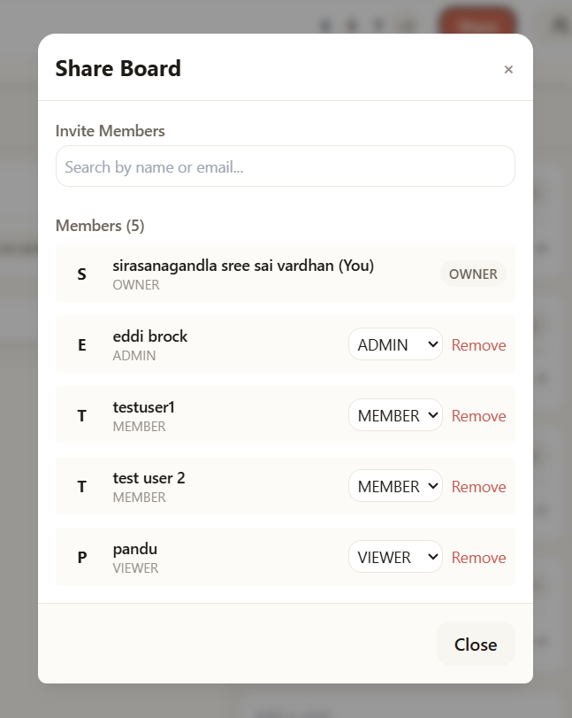
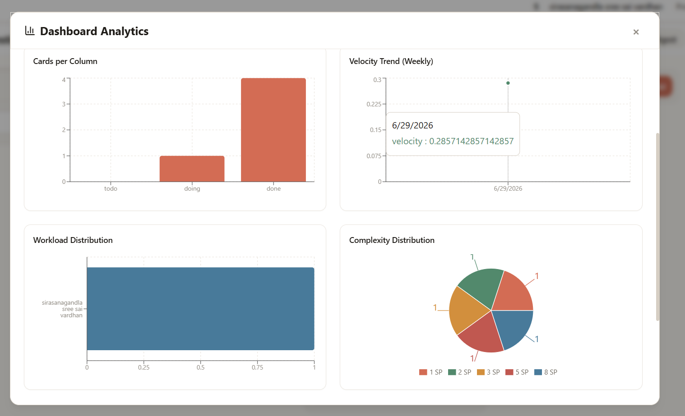
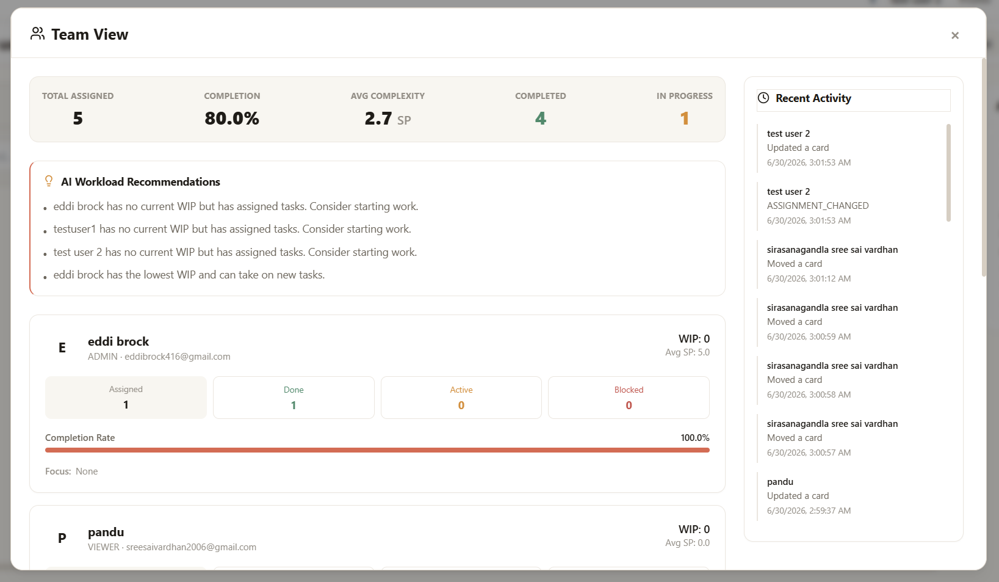

# Concurrent Collaboration Testing

## Overview

One of the primary objectives of **NexTask** is to provide a seamless real-time collaborative project management experience where multiple users can work on the same Kanban board simultaneously without requiring manual page refreshes. To validate the correctness, consistency, and reliability of the collaboration engine, a comprehensive multi-user testing session was conducted using multiple authenticated accounts with different permission levels.

The purpose of this document is to describe the testing environment, methodology, scenarios executed, and the observed results during concurrent usage of the application.

---

# Test Environment

The application was tested entirely on the production deployment to simulate a real-world usage environment.

| Component               | Technology                                                                       |
| ----------------------- | -------------------------------------------------------------------------------- |
| Frontend                | Vercel                                                                           |
| Backend                 | Railway                                                                          |
| Database                | PostgreSQL (Railway)                                                             |
| Real-time Communication | Socket.IO (WebSockets)                                                           |
| Authentication          | Session-based Authentication with Google OAuth, GitHub OAuth, and Email/Password |
| Conflict Resolution     | Optimistic Concurrency Control with Last-Write-Wins                              |

---

# Test Configuration

A total of **five independent user accounts** were connected simultaneously to the same project board.

### Authentication Methods

| Authentication Provider | Accounts |
| ----------------------- | -------- |
| Google OAuth            | 2        |
| GitHub OAuth            | 1        |
| Email & Password        | 2        |

This ensured that every supported authentication flow was exercised during the collaboration test.

---

# User Roles Tested

The collaboration test included every supported board permission level.

| Role   | Verified |
| ------ | -------- |
| Owner  | Yes      |
| Admin  | Yes      |
| Member | Yes      |
| Viewer | Yes      |

Role-based permissions, visibility restrictions, editing capabilities, and authorization rules were verified throughout the testing process.

---

# Test Scenarios

The following scenarios were executed while all five users remained connected to the same board simultaneously.

| Scenario                                   | Result |
| ------------------------------------------ | ------ |
| Multiple users connected to the same board | Passed |
| Real-time card creation                    | Passed |
| Real-time card editing                     | Passed |
| Drag-and-drop synchronization              | Passed |
| Concurrent card updates                    | Passed |
| Last-Write-Wins conflict handling          | Passed |
| Conflict notification display              | Passed |
| Real-time comment synchronization          | Passed |
| Activity history synchronization           | Passed |
| Board member synchronization               | Passed |
| AI Insights updates                        | Passed |
| Dashboard Analytics updates                | Passed |
| Team View updates                          | Passed |
| Role-based authorization                   | Passed |
| Session persistence after refresh          | Passed |
| Railway production deployment stability    | Passed |

---

# Collaboration Validation

During testing, five authenticated users interacted with the same board concurrently using separate browser profiles and authentication providers.

The following collaborative actions were performed repeatedly throughout the session:

* Creating new cards
* Editing card titles and descriptions
* Moving cards between columns
* Updating task assignments
* Adding and deleting comments
* Viewing live activity history
* Receiving AI-generated board insights
* Monitoring Dashboard Analytics
* Viewing Team Performance metrics
* Testing permission-based actions for every board role

Every modification performed by one user propagated instantly to all connected users through Socket.IO without requiring manual refreshes.

The board state remained synchronized across every client throughout the testing session.

---

# Conflict Resolution Validation

NexTask implements **Optimistic Concurrency Control** using a version field on editable entities.

When multiple users attempted to modify the same resource concurrently:

1. The client submitted the current version number with every update request.
2. The server compared the submitted version against the latest stored version.
3. If another user had already modified the resource, the server rejected the stale update with an HTTP **409 Conflict** response.
4. The client displayed a conflict notification and allowed the user to:

   * Reload the latest version
   * Copy unsaved changes
   * Continue editing manually

This implementation prevents silent data loss while maintaining a **Last-Write-Wins** conflict resolution strategy.

---

# Stability Observations

Throughout the collaboration session:

* No WebSocket disconnects were observed.
* No duplicate events were received.
* No synchronization inconsistencies occurred.
* No data corruption was observed.
* Board state remained fully consistent across all connected clients.
* Session persistence continued working after page refreshes.
* Railway deployment remained stable during the entire testing period.

The AI background scheduler continued generating insights while users actively collaborated without affecting synchronization performance.

---

# Known Testing Limitation

Due to available hardware and browser profile constraints, testing was performed with **five simultaneous authenticated users** instead of the assignment target of ten concurrent users.

All supported authentication methods and board permission levels were successfully validated within this environment.

Browser **Incognito Mode** was intentionally excluded from the primary validation because modern browsers apply stricter third-party cookie and session isolation policies that differ from normal deployment conditions. Testing was instead performed using independent authenticated browser profiles to accurately represent real-world collaborative usage.

---

# Testing Evidence

## 1. Multi-User Board Collaboration

The following screenshot demonstrates five authenticated users with different board roles connected simultaneously to the same project board.

---

## 2. Dashboard Analytics

Real-time analytics generated from the shared board, including:

* Cards per column
* Weekly velocity trend
* Workload distribution
* Complexity distribution

---

## 3. Team View

The Team View provides live collaboration metrics including:

* Team workload distribution
* Completion rate
* Average task complexity
* AI workload recommendations
* Recent collaborative activity
* Individual member statistics

---

# Conclusion

The concurrent collaboration testing demonstrates that NexTask successfully delivers a reliable real-time collaborative Kanban experience. Multiple authenticated users can interact with the same board simultaneously while maintaining data consistency, enforcing role-based permissions, and synchronizing updates instantly across all connected clients.

The collaboration engine, conflict resolution mechanism, AI background services, and production deployment operated together without observable synchronization issues or data loss throughout the testing session.
